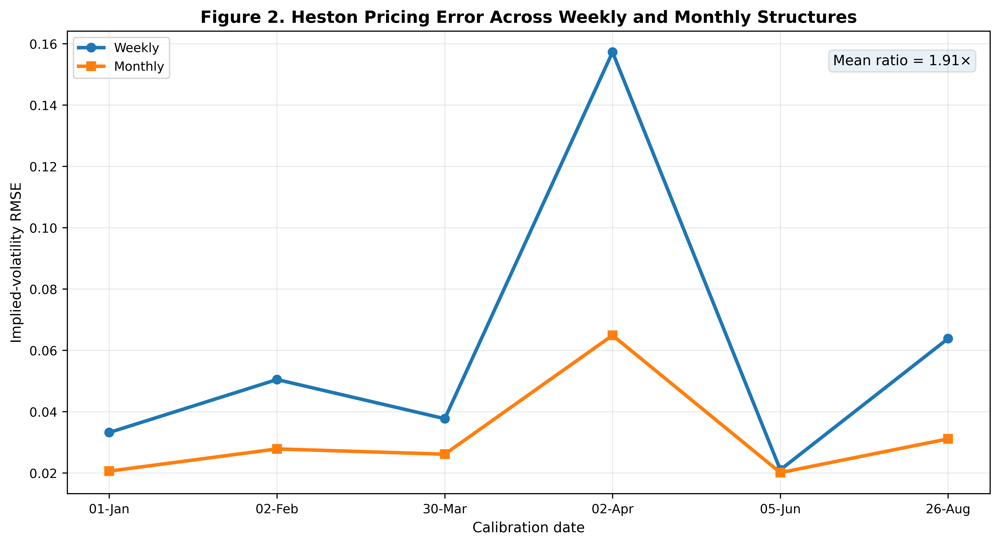
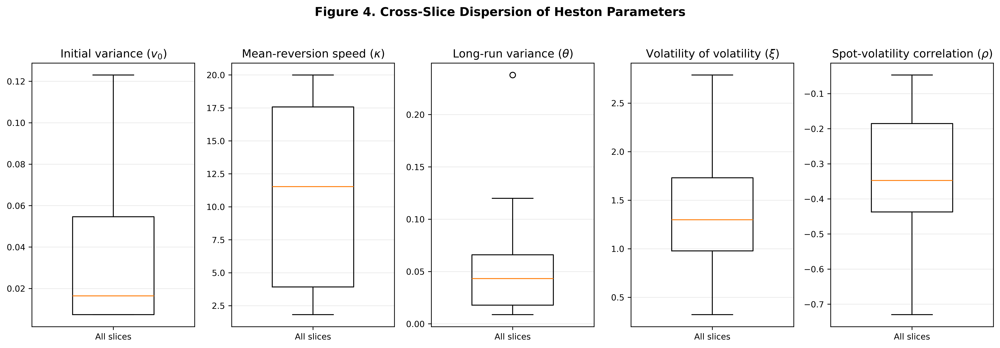
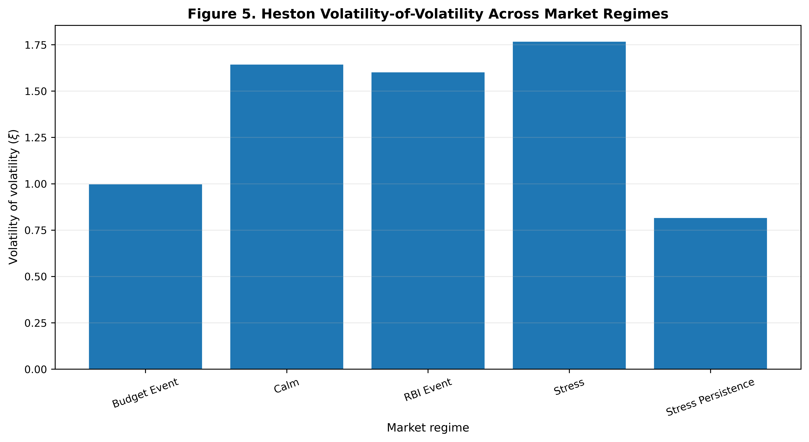
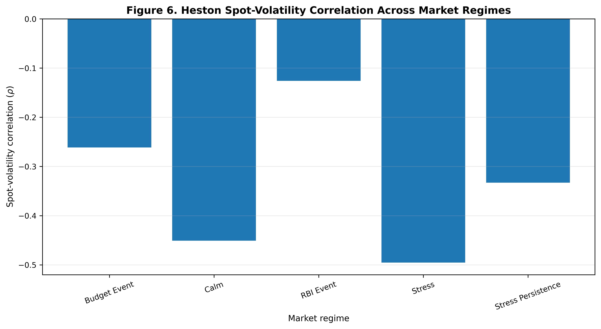
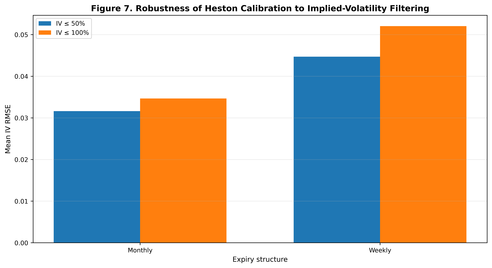
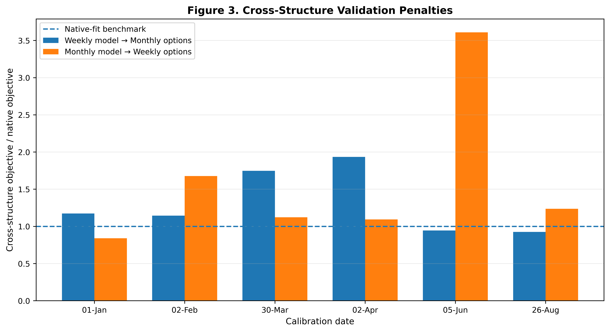
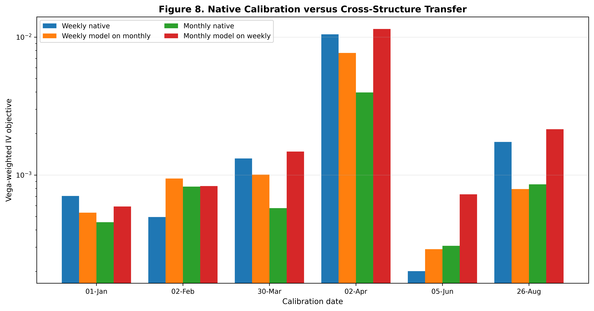

```{r setup, include=FALSE}
library(knitr)
library(tidyverse)

knitr::opts_chunk$set(
  echo = FALSE,
  warning = FALSE,
  message = FALSE,
  fig.align = "center",
  fig.pos = "H",
  out.width = "0.88\\linewidth",
  fig.width = 6.5,
  fig.height = 4.2
)
```

# Abstract

This study examines whether the parameterization of the Heston stochastic-volatility model remains stable across different expiry structures and market-regime conditions in NIFTY 50 index options. Rather than treating Heston calibration as a single static estimation problem, the study evaluates parameter variation across weekly and monthly option structures and across selected calm, event-driven, and stressed market conditions.

The empirical analysis uses NIFTY 50 European-style index option observations from six selected trading dates in 2026. The frozen data-defined eligibility universe contains 2,992 observations after applying maturity, moneyness, liquidity, and no-arbitrage filters. Following model-IV feasibility and calibration-slice construction, 2,975 observations enter the final Heston calibration objective. Market implied volatilities are obtained through Black-Scholes inversion, while Heston option prices are calculated using a Fourier-integration pricing engine. Parameters are estimated using a vega-weighted implied-volatility objective with global and local optimization procedures.

The results indicate substantial variation in the calibrated Heston parameterization across expiry structures. Mean weekly estimates differ from monthly estimates for several economically important parameters, including the mean-reversion coefficient, long-run variance, and volatility of volatility. The mean implied-volatility RMSE is 0.0606 for weekly options compared with 0.0318 for monthly options. Cross-structure validation further shows that parameterizations calibrated on one expiry structure generally experience deterioration when transferred to the other structure.

Robustness analysis using implied-volatility caps of 50% and 100% indicates that the aggregate calibration fit remains broadly similar after restricting extreme observations; parameter-level robustness under these caps is treated as a separate diagnostic. The findings suggest that a single time-invariant Heston parameterization may not adequately represent the selected NIFTY 50 option observations across different expiry structures and market conditions.

# Introduction

The pricing of index options requires models capable of representing features of observed option markets that are not adequately captured by constant-volatility assumptions. In particular, option-implied volatility surfaces exhibit variation across strike prices and maturities, while the relationship between the underlying asset and its volatility can change substantially across market conditions. Stochastic-volatility models address this limitation by allowing instantaneous variance to evolve dynamically rather than remaining constant.

The Heston model is one of the most widely used stochastic-volatility frameworks in option pricing because it introduces a mean-reverting variance process while retaining a tractable semi-analytical pricing representation. Its parameters provide economically interpretable descriptions of the variance process, including the initial variance, speed of mean reversion, long-run variance, volatility of volatility, and correlation between asset and volatility innovations.

For an index such as the NIFTY 50, however, calibration is complicated by the structure of the Indian derivatives market. Weekly and monthly expiries coexist and can exhibit different liquidity, maturity, and implied-volatility characteristics. Consequently, a parameter vector that provides a satisfactory representation of one expiry structure may not necessarily provide the same quality of representation for another.

This study therefore focuses on the stability of the Heston parameterization rather than calibration accuracy alone. The central research question is:
Does the parameterization of the Heston stochastic-volatility model remain stable across different Indian option-expiry structures and market-regime conditions?

The analysis addresses this question using six NIFTY 50 option-market snapshots covering calm, event-driven, and stressed conditions. Weekly and monthly options are calibrated separately, and the resulting parameterizations are subsequently evaluated using cross-structure validation.
The study makes four principal contributions. First, it evaluates the stability of Heston parameters across weekly and monthly NIFTY 50 option structures. Second, it examines how the calibrated parameters vary across selected market regimes. Third, it evaluates whether the observed results remain robust after restricting the implied-volatility range. Fourth, it directly tests parameter transferability by applying weekly-calibrated parameters to monthly options and monthly-calibrated parameters to weekly options.

# Literature Review

## Stochastic-Volatility Option Pricing

The Black-Scholes framework provides a foundational analytical approach to option pricing under constant volatility. However, the empirical volatility surface observed in traded options motivates models in which volatility evolves over time. Stochastic-volatility models address this limitation by modelling instantaneous variance as a latent stochastic process.

The Heston model is particularly important within this literature because it introduces a stochastic, mean-reverting variance process while retaining a semi-analytical representation for European option prices. The model allows the innovations in the underlying asset and its variance process to be correlated, providing a mechanism for capturing asymmetric features of observed option-implied volatility surfaces [@heston1993].

The five principal Heston parameters have direct interpretations within the variance dynamics: initial variance ($v_0$), speed of mean reversion ($\kappa$), long-run variance ($\theta$), volatility of volatility ($\xi$), and the correlation between asset-price and volatility innovations ($\rho$). These parameters provide a useful basis for examining whether the estimated characteristics of an option market remain stable across different samples.

## Maturity and Implied-Volatility Structure

An important issue in stochastic-volatility modelling is the relationship between model parameters and the maturity structure of implied volatility. Forde, Jacquier, and Lee [@forde2012] analyse the small-time implied-volatility smile and its term structure under the Heston model. Their analysis demonstrates that short-maturity implied-volatility behaviour is linked to the parameters governing the Heston variance process.

This result is particularly relevant when comparing weekly and monthly NIFTY 50 options. Weekly options occupy a substantially shorter maturity region than monthly contracts and may therefore contain different information about the underlying volatility dynamics. The present study consequently treats expiry structure as an empirical dimension of calibration rather than simply as another characteristic of the option sample.

## Regime Dependence in Stochastic-Volatility Models

The possibility that volatility dynamics vary across market environments has motivated regime-switching extensions of stochastic-volatility models. Elliott, Siu, and Chan [@elliott2007] develop a regime-switching Heston framework in which Heston parameters depend on the state of an observable continuous-time Markov process. Their framework demonstrates how volatility dynamics and option-pricing characteristics can vary across distinct economic states.

More recently, Mittal and Selvamuthu [@mittal2025] incorporate Markov regime switching into a broader option-pricing framework combining Heston stochastic volatility, Hull-White interest rates, and stochastic jump intensity. Their study illustrates the development of increasingly flexible models in which volatility and other financial variables can change according to different market states.

The present study differs from these formal regime-switching models. It does not estimate a Markov regime-switching Heston process. Instead, it examines whether the parameters obtained from a conventional Heston calibration vary across selected market-condition categories. The objective is therefore empirical parameter-stability analysis rather than the construction of a regime-switching pricing model.

## Extensions, Jumps, and Fourier-Based Pricing

The Heston framework has also been extended to incorporate additional sources of return and volatility dynamics. Sepp [@sepp2008] develops a framework for pricing options on realized variance within a Heston model incorporating jumps in returns and volatility. The study uses Fourier-transform methods to obtain numerical pricing solutions and illustrates the application of the framework to volatility-related derivatives and parameter estimation.

This literature is relevant to the present study because it demonstrates the flexibility of Fourier-based methods for stochastic-volatility pricing. It also highlights the possibility that additional return or volatility dynamics may be required when a basic stochastic-volatility specification encounters systematic pricing errors.

The present study deliberately retains the conventional five-parameter Heston framework. This allows the analysis to focus on whether parameter instability itself provides evidence that a single parameterization may not transfer uniformly across different expiry structures and market conditions.

## Heston Parameters and Option Risk Under Stress

The relationship between stochastic-volatility models and option risk becomes particularly relevant under stressed market conditions. Levendis, Venter, and Maré [@levendis2021] examine stress testing of option sensitivities in a stochastic market and discuss the use of stochastic-volatility modelling, including Heston-type dynamics, for analysing option behaviour under changing market conditions.

This literature motivates examining Heston parameters across calm, event-driven, and stressed observations. If the calibrated parameters vary substantially across market conditions, the resulting representation of option prices and sensitivities may also differ.

The present analysis therefore considers selected calm, event-driven, and stressed market observations. Because the empirical sample contains only a small number of observations within several market-condition categories, these comparisons are interpreted as descriptive evidence rather than as evidence of a universal causal relationship between market stress and individual Heston parameters.

## Calibration Stability and Parameter Identification

Calibration quality and parameter stability are related but distinct concepts. A model may produce a relatively small pricing error while allowing different parameter combinations to generate similar fits. This issue is particularly relevant for nonlinear stochastic-volatility models because the parameters can exhibit dependence within the calibration objective.

The distinction motivates the approach adopted in this study. Rather than evaluating Heston solely through in-sample pricing error, the analysis examines parameter dispersion, multi-start optimization, boundary behaviour, and cross-structure transferability.

The study therefore asks not simply whether Heston can fit NIFTY 50 options, but whether the fitted parameterization remains stable when the underlying option sample changes.

## Indian Index-Option Context and Research Gap

Existing research has applied stochastic-volatility and Heston-type models to equity-index derivatives. The literature also demonstrates that Heston models can be extended to incorporate regime switching, jumps, stochastic interest rates, and other sources of market dynamics [@elliott2007; @sepp2008; @mittal2025].

However, these studies address questions that are different from the specific empirical question considered here. The present study does not propose a new stochastic-volatility model or claim that Heston has not previously been applied to NIFTY 50 options.

Instead, the research gap concerns the **stability and transferability of the conventional five-parameter Heston parameterization across different NIFTY 50 option-expiry structures and selected market conditions**.

In particular, the study examines whether parameters calibrated separately on weekly and monthly options remain similar, whether the volatility-of-volatility and spot-volatility correlation parameters vary across market conditions, and whether parameters estimated on one expiry structure retain their pricing performance when transferred to another.

This approach connects the literature on Heston stochastic volatility [@heston1993], short-maturity implied-volatility behaviour [@forde2012], regime-dependent volatility [@elliott2007; @mittal2025], Fourier-based Heston extensions [@sepp2008], and stress testing of option sensitivities [@levendis2021] to an empirical investigation of parameter stability in NIFTY 50 options.

The resulting research question is therefore not whether Heston can price NIFTY 50 options, but whether a **single, stable Heston parameterization can adequately represent different expiry structures and market conditions within the NIFTY 50 option market**.

# Research Question and Hypotheses

The study investigates four hypotheses.

**H1: Expiry-structure dependence.** Heston parameters differ systematically between weekly and monthly NIFTY 50 option structures.

**H2: Volatility-of-volatility variation.** The Heston volatility-of-volatility parameter, $\xi$, varies across market-regime conditions.

**H3: Spot-volatility correlation variation.** The Heston spot-volatility correlation parameter, $\rho$, varies across market-regime conditions.

**H4: Cross-structure transferability.** A Heston parameterization calibrated to one expiry structure produces larger pricing or implied-volatility errors when applied to a different expiry structure than when calibrated directly to that structure.

# Data and Sample Construction

## NIFTY 50 Option Data

The empirical analysis uses NIFTY 50 European-style index option observations across six selected trading dates in 2026. The dates represent different market conditions and include calm, event-driven, and stressed observations.

```{r dates-table}
dates_table <- data.frame(
  Date = c(
    "01-Jan-2026",
    "02-Feb-2026",
    "30-Mar-2026",
    "02-Apr-2026",
    "05-Jun-2026",
    "26-Aug-2026"
  ),
  `Market-condition category` = c(
    "Calm",
    "Budget Event",
    "Stress",
    "Stress Persistence",
    "RBI Event",
    "Calm"
  )
)

knitr::kable(
  dates_table,
  format = "latex",
  booktabs = TRUE,
  caption = "Selected NIFTY 50 calibration dates and market-condition categories."
)
```

The initial dataset contains substantially more observations than the final calibration universe. Observations are filtered according to predetermined maturity, moneyness, liquidity, price-validity, and no-arbitrage criteria.

Calibration eligibility is determined exclusively from observable contract-level data and predefined filters. No Heston parameterization or model-implied volatility is used to determine whether an observation belongs to the calibration universe. This ensures that the calibration sample is defined before parameter optimization.

## Maturity and Moneyness Filters

Options are retained when time to expiry satisfies

\[
5 \leq DTE \leq 45,
\]

and absolute log-moneyness satisfies

\[
\left|\ln\left(\frac{K}{S}\right)\right| \leq 0.15.
\]

These restrictions limit the calibration sample to contracts with sufficient remaining maturity and economically relevant strike locations.

## Liquidity and Price Selection

The observed option price is taken from the last traded price when available and positive, with the closing price serving as the fallback observation.

Liquidity is assessed using trading contracts and open interest. The predefined liquidity criterion requires either at least 100 contracts traded or at least 1,000 units of open interest.

## No-Arbitrage Restrictions

Observed option prices are screened using strict theoretical bounds.

For calls,

\[
\max(S-Ke^{-rT},0) < C < S,
\]

while for puts,

\[
\max(Ke^{-rT}-S,0) < P < Ke^{-rT}.
\]

Call and put observations are retained jointly under the same filtering framework.

## Final Calibration Sample

The frozen, data-defined eligibility procedure produces a baseline universe of 2,992 option observations across the six calibration dates. This figure is determined before Heston parameter optimization and is therefore independent of the calibrated parameter values.

Following model-IV feasibility and the final calibration-slice construction, 2,975 observations enter the Heston calibration objective across the twelve expiry-date slices. The difference between the 2,992-observation eligibility universe and the 2,975-observation estimation sample arises at the model-evaluation stage and is not due to parameter-dependent sample selection.

Accordingly, the analysis distinguishes between the data-defined eligible universe (\(N=2,992\)) and the effective Heston estimation sample (\(N=2,975\)).

# Methodology

## Heston Stochastic-Volatility Model

Under the risk-neutral measure, the Heston model specifies the underlying asset price as

\[
dS_t = rS_tdt+\sqrt{v_t}S_tdW_t^S,
\]

while instantaneous variance follows

\[
dv_t =
\kappa(\theta-v_t)dt
+
\xi\sqrt{v_t}dW_t^v,
\]

with

\[
dW_t^S dW_t^v = \rho dt.
\]

Here, \(v_t\) denotes instantaneous variance, \(\kappa\) represents the speed of mean reversion, \(\theta\) represents long-run variance, \(\xi\) represents volatility of volatility, and \(\rho\) represents the instantaneous correlation between asset-price and volatility innovations.

The calibrated parameter vector is therefore

\[
\Theta=(v_0,\kappa,\theta,\xi,\rho).
\]

The standard Feller condition,

\[
2\kappa\theta > \xi^2,
\]

is recorded as a diagnostic rather than imposed as a calibration constraint. This avoids artificially restricting the optimization problem while allowing the condition to be evaluated for the resulting parameter estimates.

## Risk-Free Rate

The primary risk-free-rate input is the 91-day Government of India Treasury-bill yield associated with each calibration date.

```{r risk-free-table}
rf_table <- data.frame(
  Date = c(
    "01-Jan-2026",
    "02-Feb-2026",
    "30-Mar-2026",
    "02-Apr-2026",
    "05-Jun-2026",
    "26-Aug-2026"
  ),
  `91-day GOI T-bill yield` = c(
    "5.15%",
    "5.37%",
    "5.30%",
    "5.37%",
    "5.39%",
    "5.26%"
  )
)

knitr::kable(
  rf_table,
  format = "latex",
  booktabs = TRUE,
  caption = "Risk-free rates used in the six calibration snapshots."
)
```

Historical CCIL zero-coupon yield-curve observations were not consistently available for the selected historical dates. The 91-day Government of India Treasury-bill yield was therefore used as the primary historical risk-free proxy.

## Fourier Pricing

Heston option prices are obtained through the semi-analytical characteristic-function representation.

For a European call,

\[
C(S,K,T)
=
SP_1
-
Ke^{-rT}P_2,
\]

where \(P_1\) and \(P_2\) are obtained through numerical integration of the Heston characteristic function.

The implementation uses adaptive numerical integration. Fourier convergence is evaluated explicitly because short-dated options can be particularly sensitive to the integration domain and numerical truncation.

Put prices are obtained consistently through put-call parity.

## Implied Volatility

Observed market prices are converted into Black-Scholes implied volatilities through numerical inversion.

The same procedure is applied to Heston-generated option prices, allowing the calibration problem to be expressed in implied-volatility space.

## Calibration Objective

The calibration objective is based on vega-weighted squared implied-volatility errors:

\[
\mathcal{L}(\Theta)
=
\sum_{i=1}^{N}
w_i
\left(
\sigma_i^{Heston}(\Theta)
-
\sigma_i^{Market}
\right)^2,
\]

where the weights are based on Black-Scholes option vega.

The use of vega weighting gives greater importance to observations for which changes in volatility have greater price sensitivity.

## Parameter Bounds

The parameter search is performed within the following bounds:

```{r parameter-bounds}
parameter_table <- data.frame(
  Parameter = c(
    "$v_0$",
    "$\\kappa$",
    "$\\theta$",
    "$\\xi$",
    "$\\rho$"
  ),
  Lower = c(
    0.0001,
    0.01,
    0.0001,
    0.01,
    -0.999
  ),
  Upper = c(
    0.25,
    20,
    0.25,
    5,
    0.999
  )
)

knitr::kable(
  parameter_table,
  format = "latex",
  booktabs = TRUE,
  escape = FALSE,
  caption = "Heston calibration parameter bounds."
)
```

## Optimization and Multi-Start Validation

Independent starting configurations are used to evaluate optimization stability. Four starting configurations are considered: a benchmark configuration, a high-\(\kappa\) configuration, a high-\(\xi\) configuration, and a low-volatility configuration.

Boundary proximity and objective-function differences are subsequently examined.

The multi-start procedure is used to assess numerical optimization stability. It does not by itself establish global identification of the Heston parameter vector.

# Empirical Results

## Calibration Performance

Across the twelve expiry-date calibration slices, the mean implied-volatility RMSE was

\[
0.0606
\]

for weekly options and

\[
0.0318
\]

for monthly options.

Thus, the average weekly RMSE was approximately

\[
1.91\times
\]

the corresponding monthly RMSE.

```{r fig-rmse, fig.cap="Mean implied-volatility RMSE across weekly and monthly expiry structures.", out.width="0.82\\linewidth", fig.align="center"}

```

The twelve individual calibration slices are reported separately to make the relative sample size and fit quality transparent.

### Calibration Slices and Observation Counts

The six trading dates generate twelve calibration slices because each date is evaluated separately for weekly and monthly expiry structures.

```{r slice-table}
slice_table <- data.frame(
  Date = c(
    "01-Jan","01-Jan",
    "02-Feb","02-Feb",
    "30-Mar","30-Mar",
    "02-Apr","02-Apr",
    "05-Jun","05-Jun",
    "26-Aug","26-Aug"
  ),
  `Market condition` = c(
    "Calm","Calm",
    "Budget Event","Budget Event",
    "Stress","Stress",
    "Stress Persistence","Stress Persistence",
    "RBI Event","RBI Event",
    "Calm","Calm"
  ),
  Structure = c(
    "Weekly","Monthly",
    "Weekly","Monthly",
    "Weekly","Monthly",
    "Weekly","Monthly",
    "Weekly","Monthly",
    "Weekly","Monthly"
  ),
  N = c(
    315,127,
    368,173,
    295,146,
    425,195,
    272,194,
    323,142
  ),
  `IV RMSE` = c(
    0.033186,0.020596,
    0.050469,0.027836,
    0.037698,0.026115,
    0.157258,0.064892,
    0.021045,0.020108,
    0.063841,0.031117
  ),
  `IV MAE` = c(
    0.025085,0.017500,
    0.026873,0.013840,
    0.028973,0.021502,
    0.085411,0.042934,
    0.013509,0.015432,
    0.039239,0.027895
  )
)

knitr::kable(
  slice_table,
  format = "latex",
  booktabs = TRUE,
  digits = 4,
  caption = "Effective Heston calibration sample and fit statistics across the twelve expiry-date slices."
)
```


The twelve effective slice counts sum to 2,975 observations. These counts represent observations entering the final model-evaluation stage and should therefore not be interpreted as a replacement for the 2,992-observation data-defined eligibility universe.

The executed calibration results report 100% Fourier convergence within each completed slice. This convergence statistic is treated as an internal numerical diagnostic and is not interpreted as an independent external validation of pricing accuracy.


## Parameter Variation Across Expiry Structures

The estimated parameters exhibit substantial variation across the twelve calibration slices.

The weekly mean estimates are approximately:

\[
\bar{\kappa}_{W}=15.72,
\qquad
\bar{\theta}_{W}=0.0236,
\qquad
\bar{\xi}_{W}=1.04,
\qquad
\bar{\rho}_{W}=-0.425.
\]

The corresponding monthly estimates are:

\[
\bar{\kappa}_{M}=6.40,
\qquad
\bar{\theta}_{M}=0.0987,
\qquad
\bar{\xi}_{M}=1.79,
\qquad
\bar{\rho}_{M}=-0.280.
\]

```{r fig-parameter-stability, fig.cap="Heston parameter estimates across weekly and monthly expiry structures.", out.width="0.88\\linewidth", fig.align="center"}
knitr::include_graphics(
  "Heston_Paper_Figures/Figure_1_Parameter_Stability.png"
)
```

The parameter differences indicate that weekly and monthly options do not generate a single invariant Heston parameterization within the study sample.

### Paired Statistical Comparison

All five parameters are reported to avoid selective inference.

```{r parameter-tests}
test_table <- data.frame(
  Parameter = c(
    "$v_0$",
    "$\\kappa$",
    "$\\theta$",
    "$\\xi$",
    "$\\rho$"
  ),
  `Weekly mean` = c(
    0.036453,
    15.719655,
    0.023615,
    1.035956,
    -0.425245
  ),
  `Monthly mean` = c(
    0.035258,
    6.402991,
    0.098745,
    1.785573,
    -0.280457
  ),
  `Mean difference` = c(
    0.001196,
    9.316665,
    -0.075130,
    -0.749617,
    -0.144787
  ),
  `Paired t p-value` = c(
    0.87613,
    0.03910,
    0.04478,
    0.03657,
    0.25939
  ),
  `Wilcoxon p-value` = c(
    1.00000,
    0.06250,
    0.03125,
    0.06250,
    0.31250
  )
)

knitr::kable(
  test_table,
  format = "latex",
  booktabs = TRUE,
  escape = FALSE,
  digits = 4,
  caption = "Paired weekly-versus-monthly parameter comparisons across six trading dates."
)
```

The paired t-tests indicate differences in \(\kappa\), \(\theta\), and \(\xi\) at conventional 5% levels. The corresponding non-parametric Wilcoxon signed-rank results are more conservative: \(\theta\) remains below the 5% threshold, while \(\kappa\) and \(\xi\) are borderline.

Because only six trading dates are paired, these inferential results should be interpreted as within-sample sensitivity evidence rather than strong population-level inference.

A leave-one-date-out recalibration was not performed. The reported H1--H4 findings therefore rely only on the completed baseline calibration, robustness, and cross-structure analyses.

## Parameter Dispersion and Identification

Across all twelve calibration slices, the parameter ranges are:

```{r parameter-range-table}
range_table <- data.frame(
  Parameter = c(
    "$v_0$",
    "$\\kappa$",
    "$\\theta$",
    "$\\xi$",
    "$\\rho$"
  ),
  Minimum = c(
    0.007360,
    1.820086,
    0.008744,
    0.321404,
    -0.729512
  ),
  Maximum = c(
    0.123013,
    19.991096,
    0.237770,
    2.789324,
    -0.047262
  ),
  CV = c(
    1.096244,
    0.619962,
    1.040638,
    0.493883,
    0.596081
  )
)

knitr::kable(
  range_table,
  format = "latex",
  booktabs = TRUE,
  escape = FALSE,
  digits = 4,
  caption = "Parameter dispersion across the twelve calibration slices."
)
```

The coefficient of variation is particularly large for \(v_0\) and \(\theta\), at approximately 1.10 and 1.04, respectively.

```{r fig-dispersion, fig.cap="Dispersion of calibrated Heston parameters across the twelve expiry-date slices.", out.width="0.82\\linewidth", fig.align="center"}

```

The strongest cross-slice parameter relationship is between \(\kappa\) and \(\theta\), with a correlation of approximately -0.65.

These results indicate that parameter stability and parameter identification should not be treated as identical concepts. Multiple parameter combinations can generate similar calibration performance, particularly when the available maturity and moneyness ranges are restricted.

## Market-Condition Variation

The six selected trading dates are classified into five market-condition categories. Each trading date is represented by two expiry structures, weekly and monthly. 

Consequently, the number of calibration slices is twice the number of trading dates represented within each category.

```{r regime-count-table}
regime_table <- data.frame(
  `Market-condition category` = c(
    "Calm",
    "Budget Event",
    "Stress",
    "Stress Persistence",
    "RBI Event"
  ),
  `Trading dates` = c(
    2, 1, 1, 1, 1
  ),
  `Calibration slices` = c(
    4, 2, 2, 2, 2
  )
)

knitr::kable(
  regime_table,
  format = "latex",
  booktabs = TRUE,
  caption = "Trading-date and calibration-slice counts by market-condition category."
)
```

The Calm category contains two trading dates, 01-Jan-2026 and 26-Aug-2026, corresponding to four expiry-date calibration slices. Each of the remaining market-condition categories contains one trading date and two calibration slices.

Because most categories contain only one trading date, the market-condition comparisons are interpreted descriptively rather than as broad statistical estimates of regime-specific population parameters.

```{r fig-xi, fig.cap="Mean calibrated volatility-of-volatility parameter by market-condition category. Category sample sizes are reported in the accompanying table.", out.width="0.82\\linewidth", fig.align="center"}

```

```{r fig-rho, fig.cap="Mean calibrated spot-volatility correlation by market-condition category. Category sample sizes are reported in the accompanying table.", out.width="0.82\\linewidth", fig.align="center"}

```

The market-condition analysis is descriptive. The results therefore do not establish a universal monotonic relationship between market stress and individual Heston parameters.

# Robustness Analysis

The robustness analysis evaluates whether the principal calibration results are sensitive to observations with unusually high market-implied volatility. Two alternative implied-volatility restrictions are considered: an upper cap of 100\% and a more restrictive upper cap of 50\%.

The baseline, data-defined eligibility universe contains 2,992 observations. Under the global implied-volatility robustness screen, 2,989 observations remain when observations with implied volatility above 100\% are excluded, while 2,958 observations remain under the 50\% cap. Thus, 3 observations exceed 100\% implied volatility and 34 observations exceed 50\% implied volatility in the baseline universe.

```{r fig-robustness, fig.cap="Calibration performance under alternative implied-volatility caps.", out.width="0.82\\linewidth", fig.align="center"}

```

The calibration results under the alternative implied-volatility restrictions indicate that the aggregate fit-quality pattern is not solely attributable to the most extreme observations. The mean IV RMSE is approximately 0.0434 under the 100% specification and 0.0382 under the 50% specification.

The robustness analysis distinguishes between two stages of the empirical procedure. The 2,992-observation figure and the associated implied-volatility caps above refer to the frozen, data-defined eligibility universe. Calibration-slice sample sizes reported elsewhere in the paper refer to observations entering the Heston model-evaluation stage. These quantities are therefore not treated as interchangeable.

In particular, the present robustness results do not use slice-specific observation counts to infer the number of observations excluded from the global 2,992-observation universe. This avoids conflating the data-eligibility stage with subsequent model-evaluation and calibration stages.

The IV-cap analysis therefore provides evidence on robustness of aggregate calibration performance. It does not, by itself, establish that the estimated Heston parameter vectors are unchanged under the alternative specifications. Parameter-level robustness is treated as a separate diagnostic.

```{r}
robustness_table <- data.frame(
  `IV specification` = c(
    "Baseline",
    "IV <= 100%",
    "IV <= 50%"
  ),
  `Eligible observations` = c(
    2992,
    2989,
    2958
  ),
  `Mean IV RMSE` = c(
    NA,
    0.04335,
    0.03816
  )
)

knitr::kable(
  robustness_table,
  format = "latex",
  booktabs = TRUE,
  digits = 5,
  caption = "Baseline sample and aggregate fit-quality robustness under alternative implied-volatility caps."
)
```

The global robustness results show that the extreme implied-volatility observations constitute a relatively small fraction of the frozen eligible universe. The mean implied volatility decreases from approximately 19.85% in the baseline sample to 19.26% under the 50% cap, while the maximum implied volatility decreases from approximately 129.45% to 49.96%.

# Cross-Structure Validation

The cross-structure experiment provides a direct test of whether Heston parameters estimated from one expiry structure transfer effectively to another.

The mean weekly-to-monthly cross-structure penalty is approximately

\[
1.31\times,
\]

while the mean monthly-to-weekly penalty is approximately

\[
1.60\times.
\]

```{r fig-cross-structure, fig.cap="Native and transferred calibration objectives across weekly and monthly expiry structures.", out.width="0.88\\linewidth", fig.align="center"}

```

The aggregate results indicate that cross-structure transfer generally increases the calibration objective. However, the effect is not universal across individual dates.

On 01-Jan-2026, the monthly-to-weekly transfer penalty is approximately 0.84. In other words, the monthly-calibrated parameterization produces a lower objective on the weekly sample than the native weekly calibration for that date.

This exception is important for interpretation. It demonstrates that a native calibration does not necessarily provide the lowest objective when compared with another parameterization. This observation is consistent with the broader identification issue examined elsewhere in the paper, in which different parameter combinations may produce similar calibration performance. The present analysis does not, however, attribute the 01-Jan-2026 exception to a specific identification mechanism.

The result therefore cautions against interpreting every native calibration as a uniquely optimal structural representation.

```{r fig-native-transfer, fig.cap="Native versus transferred calibration performance by trading date and expiry structure.", out.width="0.88\\linewidth", fig.align="center"}

```

The cross-structure analysis therefore provides evidence of expiry-specific transferability differences without requiring that transfer deterioration occur on every individual date.

# Numerical Validation

## Fourier Convergence

The Heston pricing engine uses adaptive numerical integration of the characteristic-function representation. Fourier convergence is explicitly evaluated because short-dated options can be sensitive to the integration domain and numerical truncation.

All twelve completed calibration slices report a Fourier convergence rate of 100\% under the implemented adaptive integration procedure. This result establishes that the numerical routine reached its specified internal convergence criterion for the evaluated calibration observations.

Internal convergence, however, is distinct from independent pricing accuracy. A numerical integration routine may satisfy its own convergence criterion without guaranteeing agreement with an independently implemented reference calculation.

The study therefore treats the 100\% convergence rate as an internal numerical diagnostic rather than as independent validation of every individual Heston price.

No independent reference-pricer benchmark is used in the present empirical results. The numerical evidence is therefore limited to internal convergence diagnostics from the implemented pricing engine. Numerical termination does not by itself guarantee agreement with an independently implemented reference price, so the 100% convergence rate is not interpreted as independent pricing validation.

# Optimization and Identifiability Diagnostics

Four independent starting configurations were evaluated across the twelve calibration slices. The optimization procedure reduced the objective relative to the corresponding starting values across the tested configurations.

Percentage reduction in the objective is treated only as a convergence diagnostic because the starting configurations have different initial objective values. A larger percentage reduction therefore does not imply that one starting configuration produced a superior final parameterization. The final objective values and calibrated parameter vectors are considered the more appropriate basis for assessing convergence consistency.

Only one near-boundary estimate was identified across the final parameter diagnostics, corresponding to $\kappa$. No comparable near-boundary concentration was identified for $v_0$, $\theta$, $\xi$, or $\rho$.

Parameter dispersion remains substantial across the twelve calibration slices. The coefficient of variation is approximately 1.10 for $v_0$ and 1.04 for $\theta$. The strongest cross-slice parameter association is between $\kappa$ and $\theta$, with a correlation of approximately -0.65.

This relationship indicates that parameter stability and parameter identifiability should be treated as distinct empirical questions. A stable numerical optimization does not necessarily imply that each structural parameter is uniquely identified by the observed option prices.

```{r optimization-summary}
optimization_table <- data.frame(
  `Starting configuration` = c(
    "Benchmark",
    "High-kappa",
    "High-xi",
    "Low-volatility"
  ),
  `Mean improvement (%)` = c(
    80.4898,
    70.3752,
    63.0419,
    54.5734
  )
)

knitr::kable(
  optimization_table,
  format = "latex",
  booktabs = TRUE,
  digits = 2,
  caption = "Average objective improvement from independent starting configurations."
)
```


# Discussion

The empirical results indicate that Heston calibration for NIFTY 50 options is sensitive to expiry structure. Across the six trading dates, weekly and monthly option samples produce materially different estimates for several variance-process parameters, particularly \(\kappa\), \(\theta\), and \(\xi\).

The effective calibration sample contains 2,975 observations across twelve expiry-date slices, while the frozen data-defined eligibility universe contains 2,992 observations. This distinction is maintained throughout the analysis so that the sample-definition stage remains independent of the Heston parameter estimates.

The average implied-volatility RMSE is approximately 0.0606 for weekly options and 0.0318 for monthly options, giving a weekly-to-monthly RMSE ratio of approximately 1.91. This difference indicates that the Heston specification fits the selected weekly observations less closely than the corresponding monthly observations within the study sample.

The paired parameter comparison provides evidence of expiry-structure differences. The paired t-tests identify differences in \(\kappa\), \(\theta\), and \(\xi\), while the Wilcoxon signed-rank results are more conservative, with \(\theta\) remaining below the 5% threshold and \(\kappa\) and \(\xi\) becoming borderline. Because the comparison contains only six paired trading dates, these results are interpreted as within-sample evidence rather than broad population-level inference.

The cross-structure experiment provides a second form of evidence. The mean weekly-to-monthly transfer penalty is approximately 1.31, while the mean monthly-to-weekly transfer penalty is approximately 1.60. These aggregate penalties indicate deterioration when a parameterization is transferred between expiry structures. However, the relationship is not universal across dates. On 01-Jan-2026, for example, the monthly-to-weekly transfer penalty is approximately 0.84, indicating that the monthly parameterization produced a lower objective on that particular weekly sample than the native weekly calibration.

This exception is analytically important. It prevents the cross-structure result from being interpreted as a deterministic rule that a parameterization estimated within its native expiry structure must always outperform a transferred parameterization. Instead, the results support a more limited conclusion: expiry-specific parameterizations can differ in transferability, and the direction and magnitude of that difference can depend on the trading date.

The market-condition analysis also shows substantial variation in the calibrated parameters. Mean \(\xi\) is approximately 1.77 for the Stress category and 0.81 for Stress Persistence, while mean \(\rho\) ranges from approximately -0.50 in Stress to -0.13 in the RBI Event category. These differences are descriptive because four of the five market-condition categories contain only one trading date. They therefore do not establish a universal monotonic relationship between market stress and any individual Heston parameter.

The robustness analysis further shows that the main fit-quality patterns persist when extreme implied-volatility observations are restricted. The baseline eligible universe contains 2,992 observations, compared with 2,989 under the 100% IV cap and 2,958 under the 50% IV cap. The mean RMSE under the 50% cap is approximately 0.0382 compared with 0.0434 under the 100% cap. These results suggest that aggregate calibration performance is not driven exclusively by the small number of observations above the selected IV thresholds.

However, IV-cap robustness of fit quality should not be interpreted automatically as parameter-level robustness. The two questions are distinct because similar calibration errors can potentially be generated by different Heston parameter vectors.

The optimization diagnostics similarly provide evidence about numerical stability rather than complete parameter identification. The multi-start procedure reduces the objective from multiple initial configurations, while the resulting parameter dispersion and the negative \(\kappa\)-\(\theta\) association indicate that different aspects of the variance process can remain interdependent. The analysis therefore distinguishes successful numerical optimization from unique structural identification.

Finally, the numerical validation distinguishes internal Fourier convergence from independent pricing accuracy. All twelve completed calibration slices report full internal convergence under the adaptive integration procedure. This demonstrates successful termination of the implemented numerical routine but does not constitute an independent reference-price audit. The numerical conclusions are therefore restricted to the convergence evidence directly established by the calibration engine.

Taken together, the results support the interpretation that Heston calibration for NIFTY 50 options is conditional on expiry structure and market conditions represented in the calibration sample. The evidence does not imply that the Heston model is unsuitable for NIFTY 50 options. Rather, it indicates that a single invariant parameterization should not automatically be assumed to represent weekly and monthly option structures equally well.


# References 
